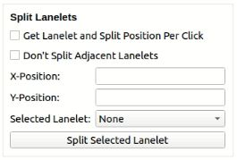
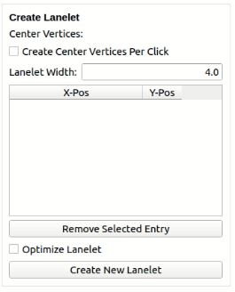

# Modifikationen des CommonRoad-Scenario-Designers

Der Commonroad-Scenario-Designer ist ein Tool, welches die Bearbeitung von Commonroad-Scenario-Dateien ermöglicht. Ein Skript zur Installation und Ausführung der korrekten Version des CRDesigners und aller nötigen Komponenten und Abhängigkeiten befindet sich im [scripts-Verzeichnis](../scripts/) des paf21-2 Projekts.

Die Dateien in diesem Ordner sind veränderte Code-Files des CRDesigners, welche Fehler beheben und dessen Funktionalität erweitern.
Dafür müssen die entsprechenden Dateien aus dem *commonroad-scenario-designer*-Verzeichnis durch die modifizierten Dateien ersetzt werden.
Diese Dateien befinden sich an den folgenden Orten:

 - commonroad_scenario_designer_gui.py: `(CRD-PATH)/crdesigner/input_output/gui/`
 - commonroad_viewer.py: `(CRD-PATH)/crdesigner/input_output/gui/misc/`
 - road_network_toolbox.py und road_network_toolbox_ui.py: `(CRD-PATH)/crdesigner/input_output/gui/toolboxes/`

Dabei entspricht `CRD-PATH` dem Installationsverzeichnis des Commonroad-Scenario-Designers. Dieses befindet sich nach dem Setup des paf21-2 Projekts standardmäßig in `~/commonroad-tools/commonroad-scenario-designer/`.

**Hinweis**: Für die korrekte Funktionsweise der Modifikationen wird Release v0.3 des CRDesigners benötigt.

## Verwendung der "Lanelet Editor"-Toolbox

### Teilen von Lanelets:

In der **Split Lanelets**-Sektion können Lanelets geteilt werden, indem die Lanelet ID ausgewählt wird und die Koordinaten des Punkts, an dem das Lanelet geteilt werden soll, eingetragen werden. Die Werte können durch Klicken auf das Lanelet automatisch übernommen werden, solange die entsprechende Checkbox ausgewählt ist. Standardmäßig werden auch alle Nachbarn eines Lanelets geteilt. Ist dies nicht gewünscht, kann die Funktion über eine weitere Checkbox deaktiviert werden.

### Erstellen von neuen Lanelets:

Neue Lanelets können über die **Create Lanelet**-Sektion einfach erstellt werden. Durch Klicken auf die Karte können Wegpunkte festgelegt werden, welche die Center-Line des neuen Lanelets darstellen. Durch Abwählen der entsprechenden Checkbox kann diese Funktion deaktiviert werden. Die Wegpunkte werden in eine Tabelle aufgenommen, wo sie einzeln entfernt oder bearbeitet werden können. Die Breite des Lanelets beträgt standardmäßig 4.0 und kann über ein Textfeld angepasst werden. Für alle weiteren Eigenschaften des Lanelets werden Standardwerte verwendet. Durch einen Klick auf den Button *Create Lanelet* wird das Lanelet der Karte hinzugefügt. Dabei kann vorher über die darüberliegende Checkbox ein Optimierungsverfahren aktiviert werden, wobei der Verlauf der gesetzten Wegpunkte mithilfe von Beziérkurven geglättet wird. Hier muss beachtet werden, dass das resultierende Lanelet nicht mehr exakt dem vorgegebenen Verlauf folgt. Ist ein präzises Lanelet gefordert, sollte die Optimierung deaktiviert werden.

### Hinweise zur Verwendung:

- Wird ein Lanelet, welches Nachbarn besitzt, alleine geteilt, sollten die Nachbarreferenzen danach manuell angepasst werden.
- Beim Festlegen der Center-Line eines neuen Lanelets durch Klicken auf die Map sollte beachtet werden, dass diese beim Klicken manchmal springt.

### Bekannte Probleme:

- Die ID-Vergabe der hinzugefügten Tools und der bereits vom CRDesigner bereitgestellten Tools unterscheiden sich. Werden die Tools nacheinander verwendet, kann es zu Problemen kommen. Lanelets können dann beispielsweise nicht korrekt hinzugefügt werden. Ein Abspeichern und neu Laden des Scenarios behebt die Probleme.
