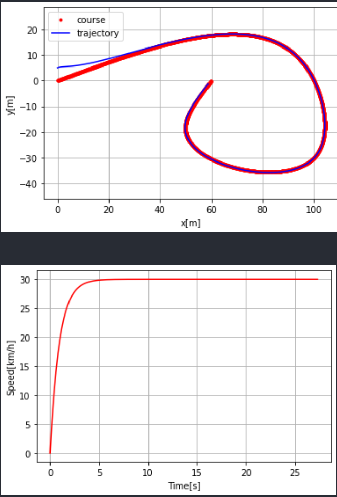
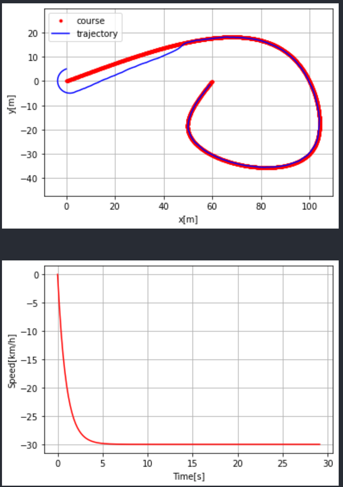
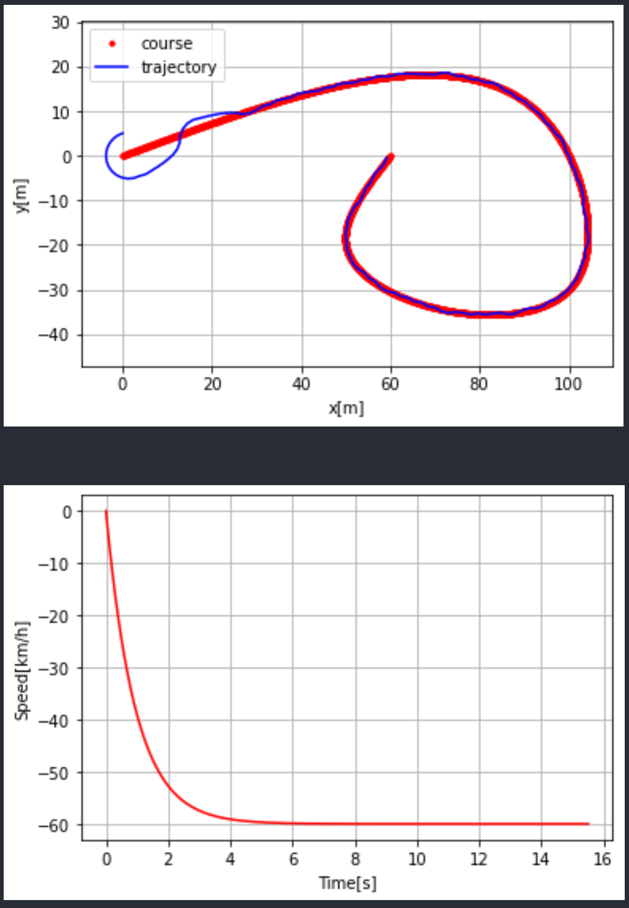
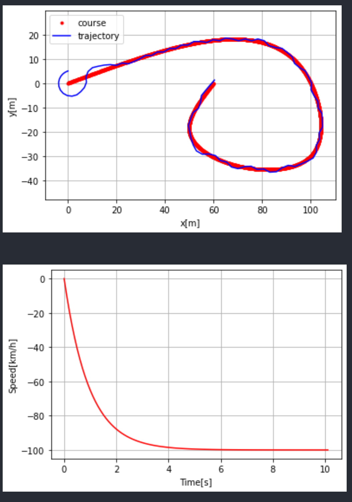
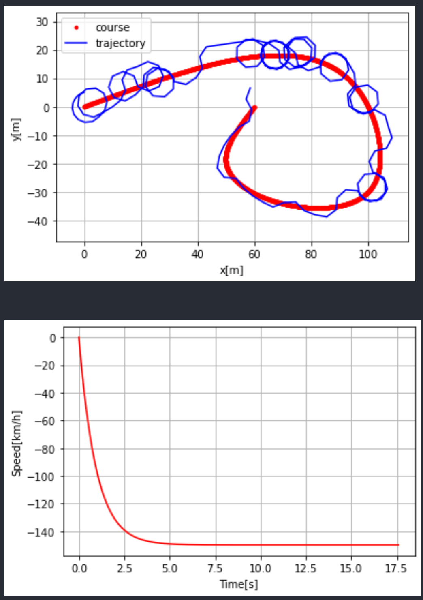
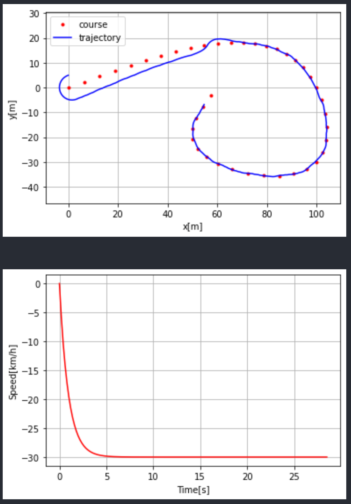

# Rückwärtsfahren mit Stanley

## 1. Erste Tests

Das Fahrzeug ist beim Rückwärtsfahren instabil, und die Lenkung ist zu spät.

Zum Testen wurde deshalb folgende Testumbung verwendet, um die Komplexität aus der Problemstellung zu nehmen und den PID und Stanley Controller einzeln zu Testen. [Github Repo](https://github.com/AtsushiSakai/PythonRobotics/blob/master/PathTracking/stanley_controller/stanley_controller.py)

## 2. Erste Beobachtung

Vorwärtsfahren funktioniert wie erwartet, keine Abweichungen aus unserer Implementierung in Carla.

Unterschiede:
- Strecke ist in vielen einzelnen Punkten aufgetragen
- Geschwindigkeit ist hier in m/s statt km/h (PSAF WS20/21 - Gruppe 2)
- Keine Physikalischen Berechnungen mit bem Fahrzeug

Normale Situation mit 30km/h vorwärts.


## 3. Änderungen zum Rückwärtsfahren

Folgende Formel:
```
# Calc front axle position
fx = state.x + L * np.cos(state.yaw)
fy = state.y + L * np.sin(state.yaw)
```

muss beim Rückwärtsfahren zu folgender Formel verändert werden:
```
# Calc front axle position
fx = state.x - L * np.cos(state.yaw)
fy = state.y - L * np.sin(state.yaw)
```

Ebenfalls muss beim Rückwärtsfahren die Geschwindigkeit negativ sein.

### 4. Beobachtungen beim Rückwärtsfahren


Normale Situation mit 30km/h rückwärts.



Bei erhöhter Geschwindigkeit rückwärts:

Rückwärts mit 60km/h:


Zu sehen ist, das der Controller am Anfang schwierigkeiten hat sich auszurichten. Es stabiliesiert sich, jedoch ist ebenfalls zu sehen, dass die Kurve nicht sauber gefahren wird.


Rückwärts mit 100km/h:


Hier ist das Phänomen noch extremer.

Rückwärts mit 150km/h:


## 4. Fazit

Es ist nicht zu empfehlen schneller als 30km/h rückwärts zu fahren, eine Erhöhte Punktedichte beim Rückwärtsfahren ist vorteilhaft.

Rückwärts fahren 30 km/h mit geringer Punktedichte:


