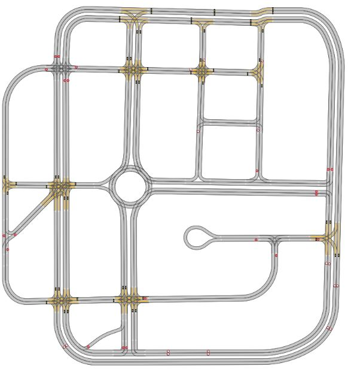
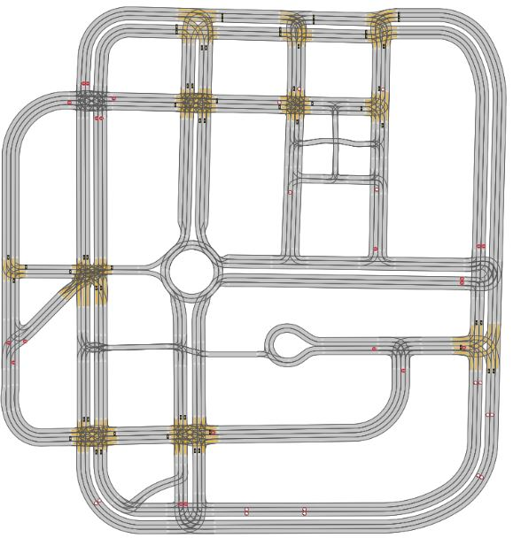

# Kartendaten

Die in diesem Verzeichnis als Commonroad Scenario abgespeicherten Kartendaten bilden die Grundlage für das autonome Fahren. Für das Umwandeln und Abspeichern der Kartendaten aus dem in Carla bereitgestellten OpenDrive-Format in ein CommonRoad-Szenario wurde das (veraltete) Opendrive2lanelet-Tool aus der CommonRoad-Toolbox verwendet. Hierfür wurden große Bestandteile des Codes der Gruppe 1 des PAF 2020/21 wiederverwendet (siehe [MapProvider](https://github.com/ll7/psaf1/blob/master/psaf_ros/psaf_global_planner/src/psaf_global_planner/map_provider/map_provider.py)). Der neuere CommonRoad-Scenario-Designer konnte hier keine zufriedenstellenden Ergebnisse liefern. Für die manuelle Modifikation der Kartendaten wurde die GUI des CommonRoad-Scenario-Designers verwendet (siehe u.a. [CRDesigner_Modified_Files](../CRDesigner_Modified_Files/)). Hinweise dazu finden sich am Ende dieser Readme. Für automatisierte Manipulationen der Kartendaten wurde das [map_manipulation-Skript](../paf_ros/paf_map_manipulation/) verwendet. Die Maps werden durch den [MapManager](../paf_ros/paf_planning/src/classes/MapManager.py) geladen, wobei zwischen Karten für die Modi mit und ohne Verkehrsregeln unterschieden wird.

Die Kartendaten im Verzeichnis `/Rules/` bilden die vorhandenen Fahrbahnen der Carla-Towns exakt ab und beinhalten zusätzliche Informationen, wie Geschwindigkeitsbegrenzungen und Haltepunkte für Ampeln und Stoppschilder, die benötigt werden, damit sich das autonome Fahrzeug an die Verkehrsregeln halten kann. Nachfolgend sind beispielhaft die "Rules"-Kartendaten von Town03 abgebildet.

Die Kartendaten im Verzeichnis `/No Rules/` wurden modifiziert, um zusätzlich zu den vorhandenen Fahrbahnen auch Abkürzungen, Seitenstreifen, Gehwege etc. zur Verfügung zu stellen. Diese können im Modus ohne Verkehrsregeln genutzt werden, um Zeit durch Abkürzen und Umfahren von anderen Verkehrsteilnehmern zu sparen. Die potentiellen Abkürzungen etc. wurden durch Abfahren der Towns identifiziert und nach einer Prioritätenliste eingebaut. Weitere Modifikationen können durch den Commonroad Scenario Designer einfach vorgenommen werden (siehe [Common Road Scenario Designer](https://commonroad.in.tum.de/scenario-designer) und [CRDesigner_Modified_Files](../CRDesigner_Modified_Files)). Ampeln, Verkehrsschilder und weitere für das Einhalten von Verkehrsregeln relevanten Informationen sind unter Umständen nicht oder fehlerhaft vorhanden. Die nachfolgende Abbildung zeigt die modifizierten Kartendaten für Town03.

## Aufbau der Kartendaten:

Die Kartendaten liegen als *Commonroad Scenario* vor. Ein solches Szenario besteht unter anderem aus einem *lanelet network*, in welchem die einzelnen Fahrbahnabschnitte als *lanelets* abgespeichert sind. Ein *lanelet* beinhaltet Referenzen zu seinen Vorgängern, Nachfolgern, rechten und linken Nachbarn sowie zu Ampeln und Verkehrsschildern die auf dem Lanelet liegen. Für eine detaillierte Beschreibung des Commonroad-Szenarios und der Lanelets sei an dieser Stelle auf die [Commonroad-Website](https://commonroad.in.tum.de/tutorials/commonroad-interface) und die [Commonroad Doku](https://commonroad-io.readthedocs.io/en/latest/) verwiesen.

## Vorhandene Kartendaten:

- Town01
- Town02
- Town03
- Town04
- Town05
- Town06
- Town07
- Town10HD

## Bekannte Probleme der Kartendaten:

- Die Haltepunkte von Ampeln und Stoppschildern liegen teils nicht genau an den Stellen, an denen das Fahrzeug tatsächlich halten sollte (z.B. an einer Haltelinie). Die Haltepunkte wurden bereits in der kompletten Town03 und vereinzelt in weiteren Maps angepasst.
- Abbiegespuren, welche auf eingebaute Abkürzungen führen, sind teilweise sehr eng, sodass das Fahrzeug der Spur nicht genau oder nur bei sehr geringen Geschwindigkeiten folgen kann, und können teilweise in Gegenspuren etc. hineinragen.

## Hinweise zur Verwendung der CRDesigner GUI und bekannte Probleme:

- Der CRDesigner wird durch das [commonroad_designer.sh-Skript](../scripts/commonroad_designer.sh) sowohl installiert, als auch gestartet. Dieses Skript behebt gleichzeitig einen Fehler im Code, der dazu führte, dass Lanelets nicht durch Anklicken ausgewählt werden konnten.
- Wenn zu einem Schild kein Lanelet referenziert wurde, kann die XML nicht mehr geöffnet werden (vorher keine Fehlermeldung).
- Referenzierte Lanelets eines ausgewählten Elements werden in der GUI nicht in die Drop-Down-Menüs übernommen.
- Referenzierte Lanelets können nicht gelöscht/verändert werden, alle Veränderungen werden lediglich hinzugefügt.
- Das "Additional Value" Textfeld des ersten Traffic-Sign-Elements ist fehlerhaft. Um einen Wert (z.B. für ein Speedlimit) eintragen zu können empfiehlt es sich, ein zweites Traffic-Sign-Element zu erstellen und das erste nachträglich zu löschen (wobei letzteres lediglich durch Code/manuelle Bearbeitung der XML möglich ist, siehe nächster Punkt).
- Wenn mehrere Traffic-Sign-Elements auf einmal eingetragen werden, kann in der GUI nur das letzte in der Liste gelöscht werden
