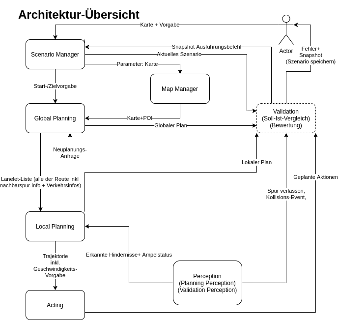

# Praktikum für Autonomes Fahren (PAF)
## Inhaltsverzeichnis 
<!-- vscode-markdown-toc -->
	* 1. [Aufgabenstellung](#Aufgabenstellung)
	* 2. [Architekturbeschreibung (WIP)](#ArchitekturbeschreibungWIP)
	* 3. [Module:](#Module:)
		* 3.1. [Acting](#Acting)
		* 3.2. [Map Manipulation](#MapManipulation)
		* 3.3. [Perception](#Perception)
		* 3.4. [Planning](#Planning)
		* 3.5. [Starter](#Starter)
		* 3.6. [Validation (optional)](#Validationoptional)

<!-- vscode-markdown-toc-config
	numbering=true
	autoSave=true
	/vscode-markdown-toc-config -->
<!-- /vscode-markdown-toc -->

###  1. Aufgabenstellung
Im Rahmen des Praktikums "Praktikum Autonomes Fahren" sollte ein autonomes Fahrzeug entwickelt werden, dass autonom von einem Startpunkt zu einem Zielpunkt fahren kann. Dafür wurde als Simulationsumgebung Carla verwendet. Das Fahrzeug an sich soll in ROS implementiert werden. 

Die Aufgabenstellung umfasst 2 Teile.\
Allgemeine Anforderungen:
1. Das Fahrzeug muss autonom einen Weg vom Startpunkt zum Zielpunkt planen 
2. Das Fahrzeug muss diesen Weg autonom abfahren 
3. Folgenden CARLA Karten müssen unterstützt werden: Town01, Town02, Town03, Town04, Town05, Town06, Town07, Town10HD
4. Das Fahrzeug befindet sich in einer Welt mit anderen Verkehrsteilnehmer (andere Autos, Motorradfahrer, Fußgänger) 

Teil 1: Modus ohne Regeln. Ziel dabei ist es ohne Beachtung aller Verkehrsregeln möglichst schnell ans Ziel zu kommen 

Teil 2: Modus mit Regeln. Ziel dabei ist es unter Beachtung aller Verkehrsregeln möglichst schnell ans Ziel zu kommen. Für Verstöße gegen die Verkehrsregeln werden Strafzeiten vergeben.

###  2. Architekturbeschreibung (WIP)

https://app.diagrams.net/#G1EHm7NKyF9iLAxI_44CEEAst4w_rrSQ1e

https://drive.google.com/file/d/1FefIPUL4YKTEWir82x4AedvwJH-2MFml/view

###  3. Module:

####  3.1. Acting
Dieses Modul dient dazu dass das Ego Vehicle einem vorgegenen Pfad folgen kann. Dabei wird ein Regler zu Regelung der Geschwindigkeit verwendet und ein Stanley-Controller zur Regelung des Lenkwinkels. Zustätzlich dient diese Modul noch dazu, selbstständig aus kritischen Situationen freizukommen

####  3.2. Map Manipulation
Diese Modul dient der Verwaltung von Kartendaten. Diese werden als Commonroad-Kartendaten abgespeichert und enthalten Informationen über alle befahrbaren Wege einer Stadt. Zusätzlich sind in den Karten alle Schilder und Amplen als auch deren zugeordneten Haltelinien eingetragen. 

####  3.3. Perception 
Diese Modul dient dazu die Umgebung um das Ego Vehicle wahrzunehmen. Dazu wird sowohl ein Semantic-Lidar-Sensor wie auch die Segmentation-Camera verwendet. 
Dabei wird der Semantic-Lidar-Sensor dazu verwendet andere Verkehrsteilnehmer zu erkennen und zu identifizieren. Die Segmentation-Kamera dient hier zur Ampelerkennung
die unter Verwendung des Systems YOLO v3 funktioniert. 

####  3.4. Planning
Dieses Modul ist für die Planung der Route des Ego Vehicles zuständig. Dafür wurde es in folgende Teimodule gegliedert:
###### Global Planner:
Der Global Planner ist für die Berechnung der kürzesten Route zwischen Start- und Zielpunkt zuständig. Dafür wird der CommonRoad Route Planner verwendet. 
###### Local Planner:
Der Local Planner ist dafür zuständig ein Segment des globalen Pfads bestmöglich abzufahren und dabei alle Verkehrsregeln beachten und korrekt auf anderes Verkehrsteilnehmer reagieren

###### Obstacle Planner:
Beim Obstacle Planner handelt es sich um ein Teilmodul des Planners, dass dazu dient auf erkannte Hindernisse, wie andere Verkehrsteilnehmer reagieren zu können. 
Funktionen diese Moduls sind das Folgen anderer Verkehrsteilnhemer unter Beachtung des Mindestabstands und das Anhalten, wenn sich ein Hindenis direkt vor dem Ego Vehicle befindet. 

####  3.5. Starter 
Dieses Modul dient zum komfortablen Starten des Projekts. Dabei werden alle notwendigen oben genannten Module gestartet, die dazu benötigt werden autonom von einem Startpunkt zu einem Zielpunkt zu gelangen. 

####  3.6. Validation (optional) 
Das Validation Modul dient dazu, beim Abfahren einer Route automatisch Fehler beim Verhalten des Fahrzeugs zu notieren und das Endergebnis nach dem Abfahren einer Route zu berwerten. 

