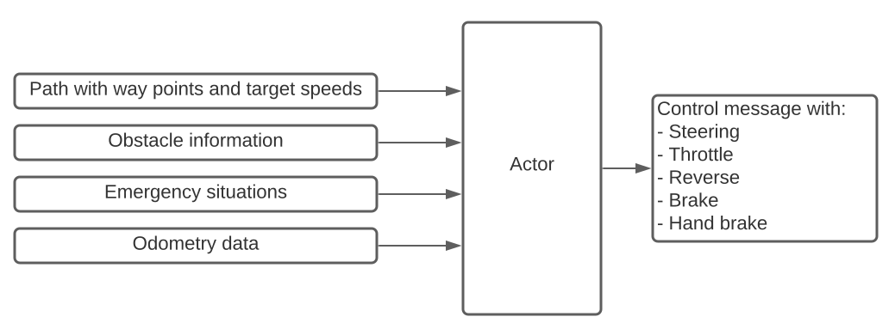

# PAF Actor

Acting package is the bridge between the Decision Making and Perception systems. It is responsible for transforming the current situation of the vehicle into a movement safe for itself and other vehicles on the road.

These are some of the features that make Actor unique:
- [Default Routine](#default-routine)
- [Unstuck Routine](#unstuck-routine)
- [Deadlock](#deadlock)
- [Obstacle following](#obstacle-following)
- [Messages](#messages)
- [StanleyController](#stanleycontroller)
- [PID Controller](#pid-controller)
- [Emergency Mode](#emergency-mode)
- [Bugabuses](#bugabuses)

## Default Routine

The Actor is running a default routine where it calculates the desired steering angle and the throttle to drive the vehicle forwards. It is important to note, that it is working closely with other packages receive important messages that indicates the behavior.

Given a path that needs to be followed. The Actor uses indicators of the odometry to determine its position.

With these values, the actor calculates the optimal steering behaviour by using a stanley controller and a PID controller to calculate the perfect throttle and brake control.

These calculations occure every time and are send to Carla via a CarlaEgoVehicleControl-Message.



## Unstuck Routine

The unstuck routine is a routine that gets used when the actor is stuck in a situation. It uses a timer and threshold values to detect if the actor is stuck, then tries to get unstuck by driving a few feet backwards without steering.

That way, the car is given some space to return to its desired behaviour.

It first sets a timer to zero. It then does some basic checks to see if the actor has moved or not. This gets checked by comparing the current speed with the desired target speed. If the current speed is below a threshold and the target speed is above this threshold a timer starts to handle this situation.

The threshold is a needed value because the car is not standing still if it drives into an obstacle.

If the timer reaches a certain value then the unstuck routine will be stopped and the actor continues normally.

For a reference in the code base see [here](src/paf_actor/vehicle_control.py).

## Deadlock

## Obstacle following

## Messages

## StanleyController

## PID Controller

## Emergency Mode

## Bugabuses


## Scrapped Ideas for the Actor Package:
## Credits:

[PSAF 2: WS 20/21 (Acting package)](https://github.com/ll7/psaf2/tree/main/Acting)
## Launch Command


If you want to run the paf_actor script independently, run:
```
roslaunch paf_actor paf_actor.launch
```

Launches a controller that truns and drives without stopping to a given location.
