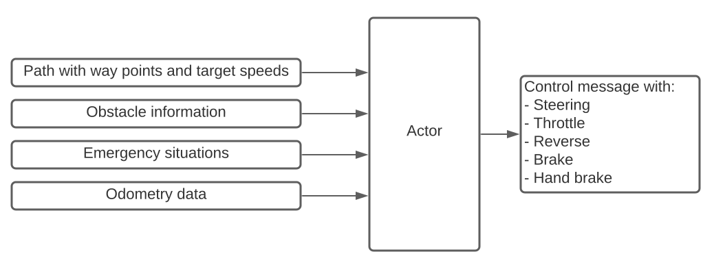

# PAF Actor

Das Acting Package ist die Brücke zwischen den Systemen für die Routenplanung und der Perception. Es ist dafür verantwortlich, die aktuellen Signale in eine für alle Verkehrsteilnehmer sichere Bewegung umzuwandeln.

Das Acting Package bietet einige vorzügliche Features, welche im Folgenden ausgeführt werden.

Ebenso sollen die diversen Verhaltensweisen des Actors ersichtlich werden, um so ein Verständnis für diverse Entscheidungen in Situationen zu erlangen.

- [PAF Actor](#paf-actor)
  - [Standardroutine](#standardroutine)
  - [Unstuck-Routine](#unstuck-routine)
  - [Deadlock](#deadlock)
  - [Verfolgung von Hindernissen](#verfolgung-von-hindernissen)
  - [Messages](#messages)
    - [Subscriber](#subscriber)
    - [Publisher](#publisher)
  - [StanleyController](#stanleycontroller)
  - [PID Controller](#pid-controller)
  - [Emergency Modus](#emergency-modus)
  - [Bugabuses](#bugabuses)
  - [Credits:](#credits)
  - [Launch Command](#launch-command)

## Standardroutine

Der Actor führt eine Standardroutine aus, in der er den gewünschten Lenkwinkel und wie stark Gas gegeben wird berechnet. Dies wird daraufhin direkt an das Fahrzeug weitergegeben. Es ist wichtig zu beachten, dass der Actor eng mit anderen Paketen zusammenarbeitet und wichtige Nachrichten erhält, die das gewünschte Verhalten vorgeben.

Gegeben ist ein Pfad, dem gefolgt werden muss. Der Akteur verwendet Indikatoren der Odometrie, um seine Position zu bestimmen. Außerdem gibt es Nachrichten für bspw. Notbremsungen und Hinderniserkennung. Dazu später mehr.

Mit diesen Werten berechnet der Akteur das optimale Lenkverhalten, indem er einen Stanley-Regler und einen PID-Regler verwendet, um die perfekte Gas- und Bremssteuerung zu berechnen.

Diese Berechnungen finden jedes Mal statt und werden über eine CarlaEgoVehicleControl-Message an Carla gesendet.



## Unstuck-Routine

Die Unstuck-Routine ist eine Routine, die verwendet wird, wenn der Actor in einer Situation feststeckt. Sie verwendet einen Timer und Schwellenwerte, um zu erkennen, ob der Actor feststeckt, und versucht dann, sich zu befreien, indem sie ein paar Meter rückwärts fährt, ohne zu lenken.

Auf diese Weise erhält das Auto etwas Raum, um zu seinem gewünschten Verhalten zurückzukehren.

Zunächst wird ein Timer auf null gesetzt. Dann werden einige grundlegende Prüfungen durchgeführt, um festzustellen, ob sich das Fahrzeug bewegt hat oder nicht. Dies wird geprüft, indem die aktuelle Geschwindigkeit mit der gewünschten Zielgeschwindigkeit verglichen wird. Wenn die aktuelle Geschwindigkeit unter einem Schwellenwert liegt und die Zielgeschwindigkeit über diesem Schwellenwert liegt, wird ein Timer gestartet, um diese Situation zu behandeln.

Die Schwelle ist ein notwendiger Wert, da das Auto nicht stillsteht, wenn es auf ein Hindernis auffährt, sondern langsam seitlich abdriftet.

Wenn der Timer einen bestimmten Wert erreicht, wird die Unstuck-Routine gestartet und der Actor fährt ein paar Meter zurück. Anschließend wird zum normalen Betrieb übergegangen.

Für eine Referenz in der Codebasis siehe [hier](src/paf_actor/vehicle_control.py).

## Deadlock

Während die Standardroutine und die Unstuck-Routine viele grundlegende Probleme lösen, kann es dennoch dazu kommen, dass der Actor sich in eine Situation manövriert, aus der er nicht mehr fortfahren kann.

Solche Situation treten vor allem dann auf, wenn andere Verkehrsteilnehmer am Geschehen teilnehmen und es zu einer Unstimmigkeit zwischen der Planung der Perception kommt.

Die Hauptrolle des Perception-Paketes ist es, eine sichere Durchquerung der Szenarien zu gewährleisten. Hierfür werden diverse Sensoren verwendet, die vom Aktor interpretiert werden müssen. Zentral ist dabei die Erkennung von Hindernissen und Verkehrsteilnehmer, welche in dem Unterabschnitt [Verfolgung von Hindernissen](#verfolgung-von-hindernissen) näher erläutert wird.

Die Planung gewährleistet die optimale Routenfindung von Start- zu Zielpunkt. Dabei wird stets das Beste getan, die schnellsten Routen zu erstellen. Hierdurch kann es ab und zu dazu kommen, das unorthodoxe Verhaltensweisen an Tag gelegt werden, zum Beispiel durch das Überqueren der Gegenfahrbahn.

Trotz der guten Absichten beider Pakete kann es trotzdem dazu kommen, dass unverhoffte Situationen entstehen, die nicht durch die Standardroutine und der Unstuck-Routine gelöst werden können. Dies geschieht beispielsweise, wenn ein Fahrzeug sich auf der Gegenfahrbahn befindet und darauf wartet, dass wir weiter fahren. Wir jedoch ebenfalls darauf warten, das dieser weiter fährt.

Bei so einer Situation handelt es sich um einen Deadlock, bei der eine zyklische Wartesituation zwischen mehreren Prozessen auftritt.

Ebenfalls können auch simplere Situationen zu einem Deadlock führen. Dies geschieht vor allem dann, wenn das Erkennen einer Ampel fehlschlägt und somit für immer auf ein Startsignal gewartet wird oder andere Verkehrsteilnehmer sich wortwörtlich querstellen.

Ein solcher Vorfall gilt es um jeden Preis zu verhindern, weshalb sich hier entschieden wurde, eine Zustandsmaschine aufzubauen, welche diverse Situation unabhängig der anderen Pakete lösen soll.

Während der gesamten Laufzeit des Aktors wird stets ein Timer laufen, welcher überprüft, wie lange sich das Fahrzeug nicht mehr bewegt. Wird ein Schwellwert übertroffen, werden alle Aktivitäten des Aktors angehalten und er geht in eine Routine rein.

Diese Routine sorgt dafür, dass sich das Fahrzeug in simplen Schritten (jeder) Situation raus manövriert. Hierfür wird setzt das Fahrzeug erst mal zurück, wartet dann und fährt später weiter vor, um dann wieder in seine ursprüngliche Routine zu gelangen.

Dadurch, dass auf kein anderes Signal von Paketen gewartet wird, ist es wichtig, die Zeit optimal einzustellen. Ist die Zeit zum Erkennen eines Deadlocks zu gering, kann es dazu kommen, dass die Routine anspringt, obwohl es zu keinem Deadlock gekommen ist und wir lediglich auf eine Ampelphase warten.

Ist diese Zeit jedoch zu lange, können wichtige Sekunden verloren gehen, in der das Ziel erreicht hätte werden können.

Nähere Implementierungsdetails können im Source Code [hier](src/paf_actor/vehicle_control.py) nachgeschlagen werden.
## Verfolgung von Hindernissen

Aufgrund der vielen Verkehrsteilnehmer, sowohl motorisiert als zu Fuß, ist es umso wichtiger, die diversen Herausforderungen zu meistern. Hier kristallisiert sich ein eindeutig vorteilhaftes Verhalten heraus. Dies Verhalten setzt folgende Punkte voraus:

1. Bleibe in der Mitte Spur
2. Fahre niemandem auf
3. Behalte die Fußgänger im Auge
4. Passe dich anderen an
5. Sei kein Bully

Mithilfe einer wohldefinierten Message der [PafObstacleFollowInfo.msg](../paf_messages/msg/PafObstacleFollowInfo.msg), können ausreichende Informationen übergeben werden, um diese Punkte zu befolgen.

``` msg
float32 speed
float32 distance
bool no_target
bool is_vehicle
```

Das `no_target` bool signalisiert uns, ob sich gerade ein Hindernis vor uns befindet. Springt dieses auf `False`, wird dem Pfad zwar noch gefolgt, jedoch muss die Geschwindigkeit dementsprechend angepasst werden.

Ein `True` deutet an, dass vor uns ein Ziel verschwunden ist und wir wieder in den Normalbetrieb übergehen können.

Falls sich etwas vor uns befindet, ist es wichtig zu wissen, wie weit weg sich dieses Hindernis vor uns befindet. Hierfür wird der Wert `distance` herbeigezogen.

Sind Hindernisse zu weit weg, können diese ignoriert werden. Sind sie hingegen gefährlich nahe, müssen diese behandelt werden.

Dies bedeutet in unserem Fall, Abstand zu halten. Hierfür bewegen wir uns mit der gleichen Geschwindigkeit wie das Hindernis (`speed`).

Um jedoch nicht plötzlich anzuhalten, sondern sich dem Hindernis kontrolliert anzunähern, muss sich der Actor etwas schneller fortbewegen als das Hindernis vor uns.

Im Spezialfall, dass es sich nicht um ein Fahrzeug handelt, wird das `is_vehicle` bool verwendet.

Ohne Regeln wird auf diese Verkehrsteilnehmer keine Rücksicht genommen. Deshalb könnte es nahe liegen, keine Rücksicht auf Verluste zu nehmen.

Hier kommt jedoch das Debakel der Physik zum Einsatz. Aufgrund der physikalischen Interaktion kommt es dazu, dass sich unverhoffte Situationen ergeben, in denen das Fahrzeug am Ende fahrunfähig wird.

Deshalb dürfen erkannte Fußgänger nicht zu schnell überfahren werden. So ist ein erfolgreiches Erreichen des Ziels gewährleistet.

## Messages

Um eine erfolgreiche Kommunikation mit den anderen Paketen aufzubauen, werden diverse Kommunikationswege aufgebaut.

### Subscriber

- `/carla/{role_name}/odometry` `Odometry` Odometry Daten des Fahrzeugs
- `/paf/paf_local_planner/path` `PafLocalPath` Nachricht des Lokalen Pfades
- `/local_planner/{role_name}/emergency_break` `Bool` Signalisiert eine Notbremse
- `/paf/paf_obstacle_planner/following_info` `PafObstacleFollowInfo` Info über Hindernisse

### Publisher

- `/carla/{role_name}/vehicle_control_cmd` `CarlaEgoVehicleControl` Fahrzeugssteuerung Nachricht
- `/paf/paf_validation/tensorboard/scalar` `PafLogScalar` Geschwindigkeit loggen
- `/paf/paf_validation/tensorboard/scalar` `PafLogScalar` Zielgeschwindigkeit loggen
- `/paf/paf_validation/tensorboard/scalar` `PafLogScalar` Geschwindigkeitsfehler loggen
- `/paf/paf_validation/tensorboard/scalar` `PafLogScalar` Lenkung loggen
- `/paf/paf_validation/tensorboard/scalar` `PafLogScalar` Gassteuerung loggen

## StanleyController

Der StanleyController ist für die Bestimmung des Lenkeinschlags zuständig. Dazu werden entsprechend dem Paper [Comparison of lateral controllers for autonomous vehicle: experimental results](https://hal.archives-ouvertes.fr/hal-02459398/document) der Heading Error und der Crosstrack Error berechnet.

Eine Implementierung dessen wurde von uns von Gruppe 2 aus dem Vorjahr übernommen. [Hier](https://github.com/ll7/psaf2/wiki/Path-Tracking-Algorithmen#stanley-methode) befindet sich deren Dokumentation zum Thema.

Unserer Erfahrung nach eignet sich der StanleyController sehr gut für niedrige und mittlere Geschwindigkeiten beim Vorwärtsfahren. Sobald die Geschwindigkeit zu hoch wird (>100), fängt das Fahrzeug an zu wobbeln. Rückwärtsfahren ist auch möglich, aber wurde von uns nicht benötigt und deshalb nicht optimal eingebaut.

Informationen zu den Rückwärtstests befinden sich [hier](../../docs/paf_actor/backwards/reverse.md)

Nähere Implementierungsdetails können im Source Code [hier](src/paf_actor/stanley_control.py) nachgeschlagen werden.
## PID Controller

Der PID Controller ist dafür zuständig, festzulegen, wie stark Gas gegeben und gebremst wird. Die Implementierung wurde nahezu 1:1 von Gruppe 2 übernommen. Gruppe 2 hat für das Abstandhalten zu anderen Verkehrsteilnehmern einen weiteren PID Controller benutzt, den wir aber nicht benötigen, wie oben beschrieben.
## Emergency Modus

Der Emergency Modus wird verwendet, um im Notfall so schnell wie möglich zu bremsen. Dazu wird die oben genannte Nachricht von Planning oder Perception an den Actor gesendet, welcher dann eine Vollbremsung einlegt. Dies wird erst gestoppt, wenn die Nachricht kommt, dass der Notfall aufgelöst wurde.

Dieser Modus überschreibt alle anderen Regeln.

Wie am schnellsten gebremst werden kann, wurde ausführlich getestet. Die Ergebnisse befinden sich [hier](../../docs/paf_actor/backwards/braking.md)

## Bugabuses

Beim Bremsen wird der Rückwärtsgang eingelegt und Gas gegeben.

Außerdem der Lenker im Falle der Notbremse maximal eingeschlagen, um den Bremsweg zu verringern. Dies führt dazu, dass das Auto nach dem Stillstand weiterhin seitlich abdriftet, weshalb die Notbremse dann wieder gelöst werden muss.

Tipp: Beim Einparken kann die Notbremse helfen, um seitlich in die Lücke zu rutschen ;)

## Credits:

[PSAF 2: WS 20/21 (Acting package)](https://github.com/ll7/psaf2/tree/main/Acting)
## Launch Command


Um den Actor manuell zu starten, muss folgender Befehl eingegeben werden:
```
roslaunch paf_actor paf_actor.launch
```
