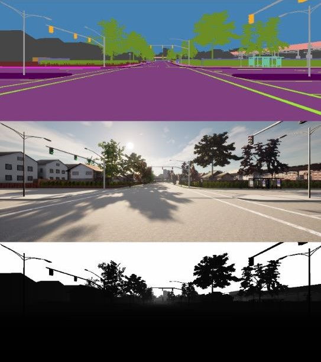
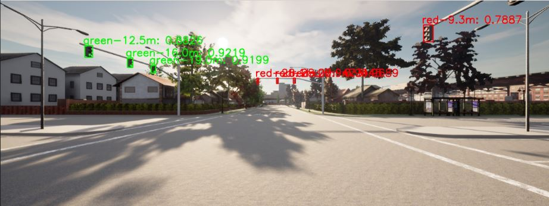
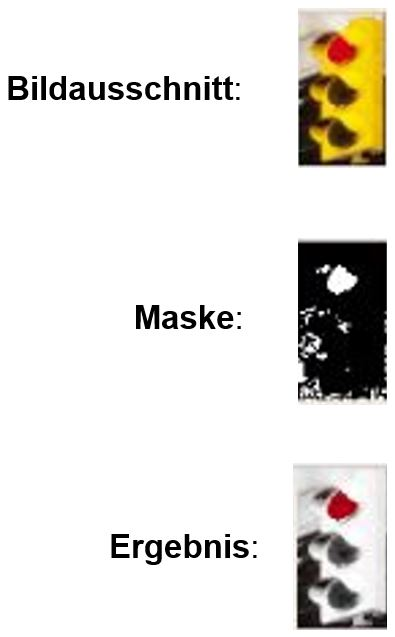

# Perception

## Semantic Lidar (Hinderniserkennung)

Erfasst Hindernisse um das Auto herum, wie z.B. andere Verkehrsteilnehmer, als Datenpunkte mit Hilfe eines Semantic-Lidar-Sensors "Lidar1" und sendet die Information über das Topic /paf/paf_perception/obstacles. Diese enthält Informationen aus drei Positionskoordinaten, bestehend aus jeweils einer x- und y-Koordinate, sowie einem Distanzwert zwischen dem Hindernis und dem Auto. Genauer handelt es sich bei den Positionspunkte um die beiden weit entferntesten Punkte plus der Punkt mit der kürzesten Distanz. Darüber hinaus enthält eine gesendete Nachricht Informationen über die berechnete Geschwindigkeit über Positionsänderungen innerhalb zweier Zeitpunkte und über den Hindernistyp, der entweder den Wert "Vehicles" oder "Pedestrians" annehmen kann.

Credits: PSAF 2, WS 20/21 (perception package)

```
Subscribed Topics:
- /carla/ego_vehicle/semantic_lidar/lidar1/point_cloud (PointCloud2)
- /carla/ego_vehicle/odometry (Odometry)

Published Topics:
- /paf/paf_perception/obstacles (PafObstacleList)

Launchers:
- roslaunch paf_perception semantic_lidar.launch
```

## TrafficLightDetection:

```
Subscribed Topics:
- /paf/paf_local_planner/activate_traffic_light_detection (Bool)

Published Topics:
- /paf/paf_perception/detected_traffic_lights (PafDetectedTrafficLights)

Launchers:
- roslaunch paf_perception traffic_light_detector.launch
```

Die TrafficLightDetection dient dem Erkennen des Zustands von Ampeln. Die Kartendaten für den Modus mit Verkehrsregeln enthalten bereits alle Punkte, an welchen gegebenenfalls für eine Ampel angehalten werden muss. Die Aufgabe der Perception beschränkt sich somit auf das Filtern von Ampeln aus dem RGB-Kamera-Bild und das Klassifizieren dieser Ampeln. Stoplinien oder Ähnliches müssen für das korrekte Anhalten nicht erkannt werden. Die Komponenten der TrafficLightDetection wurden von Gruppe 1 des PAF 2020/21 übernommen, angepasst, vereinfacht und erweitert. Die Funktionalität basiert auf der Auswertung eines [ResNet18](https://pytorch.org/hub/pytorch_vision_resnet/)-Klassifikationsnetzes.

**Hinweis**: Für die Klassifizierung wird PyTorch benötigt. Hierfür muss PyTorch entsprechend der Anleitung auf [Pytorch.org](https://pytorch.org/) installiert werden. Dabei ist auf die lokal verwendete Treiberversion zu achten. Für eine optimale Nutzung wird eine Nvidia-Grafikkarte in Verbindung mit dem ensprechenden Cuda-Treiber benötigt.

### Module:

Die TrafficLightDetection setzt sich aus den folgenden Komponenten zusammen:

- [DepthCamera.py](./src/DepthCamera.py): Subscriber auf das Bild der Tiefenkamera
- [SegmentationCamera.py](./src/SegmentationCamera.py): Subscriber auf das Bild der Segmentationskamera, ermöglicht Filtern des Bilds nach den unterschiedlichen Tags
- [RGBCamera.py](./src/RGBCamera.py): Subscriber auf das Bild der RGB-Kamera
- [FusionCamera.py](./src/FusionCamera.py): Synchronisiert die Bilder der zuvor genannten Kameras
- [traffic_light_detector.py](./src/traffic_light_detector.py): Verwendet die Daten der FusionCamera, um Ampeln und deren Zustände zu erkennen
- [perception_util.py](./src/perception_util.py): Hilfsfunktion für Bildanzeige

Tiefen-, Segmentation- und RGB-Kamera werden in der Datei [sensors.json](./sensors.json) angelegt und besitzen jeweils die ID "front". Das nachfolgende Diagramm gibt einen Überblick über den Zusammenhang der Module und über die Funktionsweise der Erkennung:


### Ablauf der Detection:

Bei der Initialisierung der `TrafficLightDetector`-Klasse werden unter Anderem die Bestandteile und Parameter des Deep Learning geladen und konfiguriert. Das trainierte Model, welches sich im [models-Verzeichnis](./models/) befindet und von Gruppe 1 des PAF 2020/21 übernommen wurde, wird geladen und falls gewünscht und möglich auf die GPU portiert, um die CPU zu entlasten. Desweiteren wird die minimale Confidence, die die Klassifikation einer Ampel aufweisen muss, festgelegt.

Die `FusionCamera` speichert die erhaltenen RGB- und Tiefenbilder gemeinsam mit deren Zeitstempeln ab. Sobald ein Bild der SegmentationCamera empfangen wird, matcht die FusionCamera dieses Bild mit den RGB- und Tiefenbildern, welche den geringsten zeitlichen Unterschied zum Segmentationbild aufweisen. Die synchronisierten Bilder werden an den `TrafficLightDetector` weitergegeben. Zuvor wird das Segmentationbild nach den gewünschten Tags gefiltert. Somit beinhaltet das Segmentationbild zu diesem Zeitpunkt nur noch die Bereiche des Bilds, in welchen eine Ampel zu sehen ist.



Sobald der `TrafficLightDetector` neue Bilddaten empfängt, werden die einzelnen Bildausschnitte, welche Ampeln enthalten, extrahiert und klassifiziert, insofern die Detection aktiviert ist. Die Detection kann über das Topic `/paf/paf_local_planner/activate_traffic_light_detection` aktiviert oder deaktiviert werden. Für die Extraktion der Bildausschnitte wird der Canny-Algorithmus auf das Segmentationbild angewendet, wodurch Konturen im Bild erkannt werden. Für alle erkannten Konturen wird eine Bounding-Box erstellt und die entsprechende Bildbereiche des RGB- und Tiefenbildes werden ausgeschnitten. Über die Informationen des Tiefenbilds werden Ampeln mit einer Distanz von 100m oder mehr ausgeschlossen. Anschließend werden ein Label (`red`, `green`, `yellow` oder `back`) und eine zugehörige Confidence durch Auswertung des RGB-Bildausschnitts mithilfe des Klassifikationsnetzes ermittelt. Auf die erkannten Bildausschnitte wird daraufhin eine Non-maximum Suppression (NMS) angewendet, um einzelne erkannte Objekte aus sich überschneidenden Bounding-Boxes zu ermitteln. Abschließend wird für alle erkannten Ampeln, welche die minimale Confidence überschreiten, ein `DetectedObject` erstellt. Die DetectedObjects werden dann als `PafDetectedTrafficLights`-Message gepublisht. Das Ermitteln der für die aktuelle Situation relevanten Ampel aus der Menge der erkannten Ampeln ist **nicht** Aufgabe der TrafficLightDetection. Das Ergebnis der Detection ist im nachfolgenden Bild dargestellt:



### Problembehandlung in Town04:

In Town04 befindet sich eine Ampel, hinter der eine rote Werbetafel liegt. Dies führte mit der vorgestellten Detection dazu, dass diese Ampel immer als rot erkannt wurde, da die ermittelten Bildausschnitte auch einen kleinen Bereich um die Ampel herum beinhalten. Da das autonome Fahrzeug an roten Ampeln anhält und erst nach Erkennen einer grünen Ampel weiterfährt, führte dieser Zustand zu einem Deadlock. Dem konnte entgegengewirkt werden, indem die Bounding-Boxes für Town04 vor der Klassifizierung um einen festen Wert verkleinert wurden, sodass die Umgebung der Ampel kaum oder nicht mehr im Bildausschnitt vertreten ist. Dieses Vorgehen führt zwar zu veringerten Confidences bei der Klassifizierung, weshalb die minimale Confidence für Town04 herabgesetzt werden muss, jedoch lassen sich dadurch alle Ampeln in einem akzeptablen Rahmen erkennen.

### Problembehandlung in Town10HD:

Die Ampeln in Town10HD haben statt einer grauen eine gelbe Lackierung. Manche Ampeln wurden daher durchgängig als gelb erkannt, unabhängig vom tatsächlichen Zustand. Um dennoch rote und grüne Ampeln erkennen zu können, werden die RGB-Bildausschnitte in Town10HD vor der Klassifikation farblich bearbeitet. Ein Ausschnitt wird zunächst in den HSV-Farbraum konvertiert. Anschließend werden Masken erstellt, um die Rot- und Grünanteile zu extrahieren. Der Rest des Ausschnitts wird in Graustufen konvertiert, woraus die ursprünglich roten und grünen Bereiche entfernt werden. Abschließend werden das Graustufen-Bild und die Rot- und Grünteile addiert und das Resultat wieder in den RGB-Farbraum konvertiert. Die Umwandlung ist in der untenstehenden Grafik veranschaulicht.



Gelbe Ampeln können dadurch zwar nicht mehr erkannt werden, diese werden jedoch für ein korrektes Verhalten des Fahrzeugs nicht benötigt. Für Town10HD musste die minimale Confidence deutlich herabgesetzt werden, da es eine Ampel auf der Map gibt, die aufgrund ihrer Distanz zum Haltepunkt nur schlecht erkannt werden kann. Um fehlerhafte Detections zu vermeiden, werden querformatige Bildausschnitte herausgefiltert. Zusätzlich werden alle Ampeln verworfen, die in der linken Bildhälfte liegen, da diese in Town10HD nicht die für die aktuelle Situation relevanten Ampeln darstellen.

### Hinweise zur Verwendung:

- Im Debug-Modus öffnet sich beim Start der TrafficLightDetection ein Fenster, welches das aktuelle RGB-Bild gemeinsam mit den erkannten Ampeln anzeigt (siehe oben). Hierüber lässt sich die Funktion sehr leicht verifizieren.
- Die "...Camera.py"-Module enthalten jeweils ebenfalls Debug-Code, welcher die aktuellen Bilder ausgibt, wenn die Dateien als Python-Skript ausgeführt werden.
- Die einzelnen Schritte der Farbbearbeitung in Town10HD können über die auskommentierten Befehle (`cv2.imshow(...)`) angezeigt werden. Hierfür muss jedoch die Anzeige des Debug-Fensters deaktiviert werden.

### Bekannte Probleme:

- In Towns, die ein europäisches Ampel-Layout enthalten, d.h. das Fahrzeug hält direkt an der Ampel, besteht die Gefahr, dass die Sensoren die Ampel am Haltepunkt nicht mehr erfassen können. Eine Erkennung ist dann natürlich nicht mehr möglich.
- Die Qualität der Detection ist in den Towns 04 und 10HD aufgrund der beschriebenen Maßnahmen verringert. In Tests konnte sich das Fahrzeug zwar durchgehend der Situation entsprechend angemessen verhalten, jedoch ist das Risiko von fehlerhaften oder verzögerten Detections in diesen Towns erhöht.

### Training des neuronalen Klassifikationsnetzes:

Neue Modelle können mithilfe des Codes von Gruppe 1 des PAF 2020/21 trainiert werden. Dies wurde nicht in unser Projekt übernommen, da das bereits trainierte Model übernommen wurde und Probleme anderweitig behoben wurden. Für weitere Informationen sei daher an dieser Stelle auf das [Repository von PAF 2020/21 Gruppe 1](https://github.com/ll7/psaf1/tree/master/psaf_ros/psaf_perception) verwiesen.
