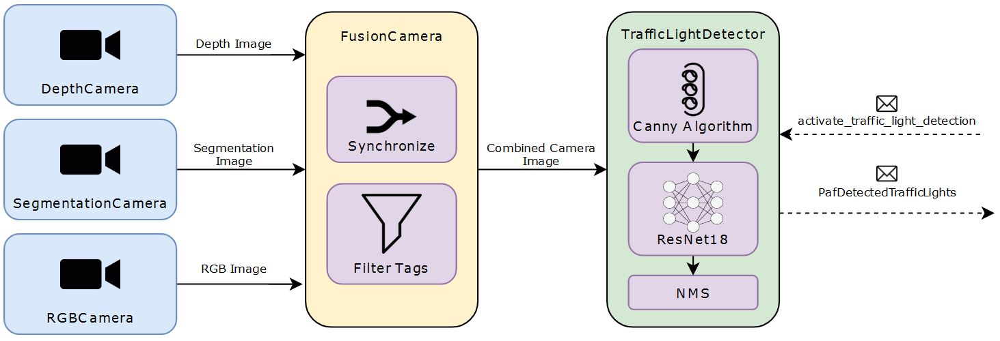

# Perception

## Credits:

PSAF 2: WS 20/21 (perception package)

## Launch Command

Reads obstacles from segmented lidar sensor ```lidar1``` and publishes a ```PafObstacleList```. Each ```PafObstacle```
has the two outermost (north-aligned) bounding box points and the closest point as attributes.

```
Subscribed Topics:
- /carla/ego_vehicle/semantic_lidar/lidar1/point_cloud (PointCloud2)
- /carla/ego_vehicle/odometry (Odometry)

Published Topics:
- /paf/paf_perception/obstacles (PafObstacleList)

Launchers:
- roslaunch paf_perception semantic_lidar.launch
```

## TrafficLightDetection:

```
Subscribed Topics:
- /paf/paf_local_planner/activate_traffic_light_detection (Bool)

Published Topics:
- /paf/paf_perception/detected_traffic_lights (PafDetectedTrafficLights)

Launchers:
- roslaunch paf_perception traffic_light_detector.launch
```

Die TrafficLightDetection dient dem Erkennen des Zustands von Ampeln. Die Kartendaten für den Modus mit Verkehrsregeln enthalten bereits alle Punkte, an welchen gegebenenfalls für eine Ampel angehalten werden muss. Die Aufgabe der Perception beschränkt sich somit auf das Filtern von Ampeln aus dem RGB-Kamera-Bild und das Klassifizieren dieser Ampeln. Stoplinien oder Ähnliches müssen für das korrekte Anhalten nicht erkannt werden. Die Komponenten der TrafficLightDetection wurden von Gruppe 1 des PAF 2020/21 übernommen, angepasst, vereinfacht und erweitert. Die Funktionalität basiert auf der Auswertung eines [ResNet18](https://pytorch.org/hub/pytorch_vision_resnet/)-Klassifikationsnetzes.

**Hinweis**: Für die Klassifizierung wird PyTorch benötigt. Für die Installation kann das [\_setup_cuda_torch.sh-Skript](../../scripts/subscripts/_setup_cuda_torch.sh) ausgeführt werden. Alternativ kann PyTorch entsprechend der Anleitung auf [Pytorch.org](https://pytorch.org/) installiert werden. Dabei ist auf die lokal verwendete Treiberversion zu achten. Für eine optimale Nutzung wird eine Nvidia-Grafikkarte in Verbindung mit dem ensprechenden Cuda-Treiber benötigt.

### Module:

Die TrafficLightDetection setzt sich aus den folgenden Komponenten zusammen:

- [DepthCamera.py](./src/DepthCamera.py): Subscriber auf das Bild der Tiefenkamera
- [SegmentationCamera.py](./src/SegmentationCamera.py): Subscriber auf das Bild der Segmentationskamera, ermöglicht Filtern des Bilds nach den unterschiedlichen Tags
- [RGBCamera.py](./src/RGBCamera.py): Subscriber auf das Bild der RGB-Kamera
- [FusionCamera.py](./src/FusionCamera.py): Synchronisiert die Bilder der zuvor genannten Kameras
- [traffic_light_detector.py](./src/traffic_light_detector.py): Verwendet die Daten der FusionCamera, um Ampeln und deren Zustände zu erkennen
- [perception_util.py](./src/perception_util.py): Hilfsfunktion für Bildanzeige

Das nachfolgende Diagramm gibt einen Überblick über den Zusammenhang der Module und über die Funktionsweise der Erkennung:


