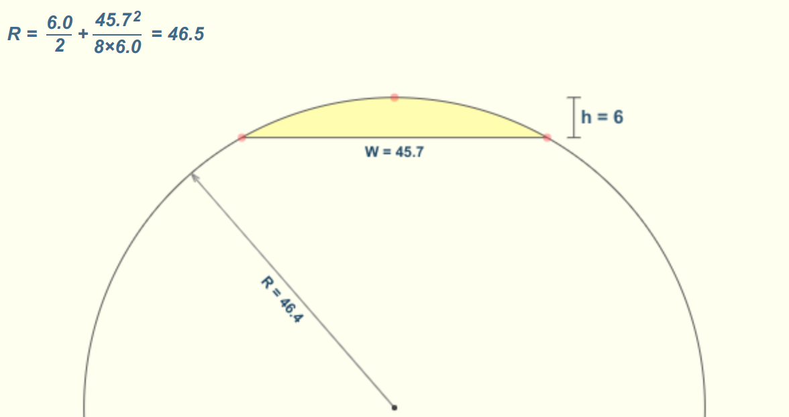
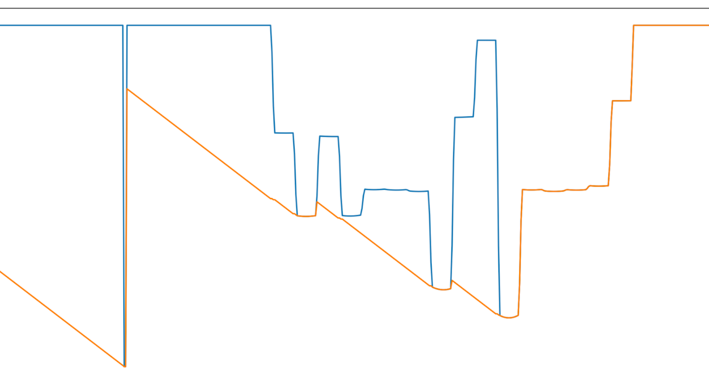
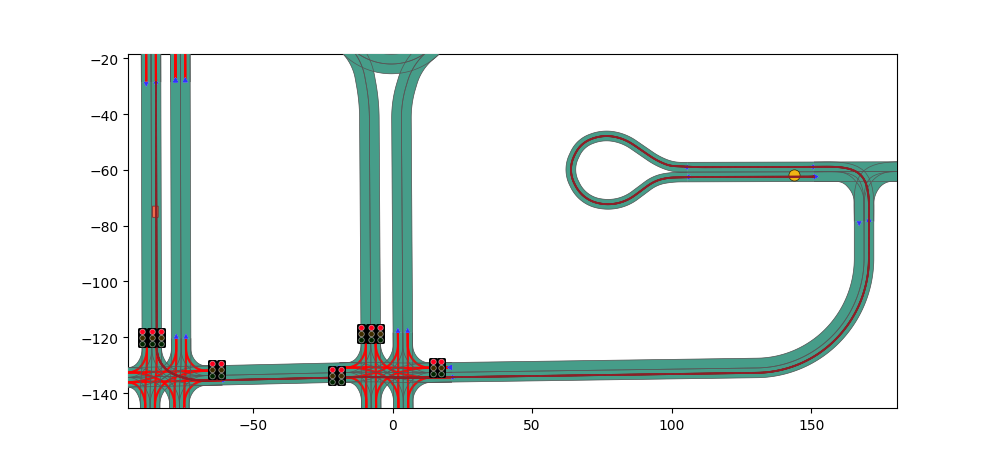
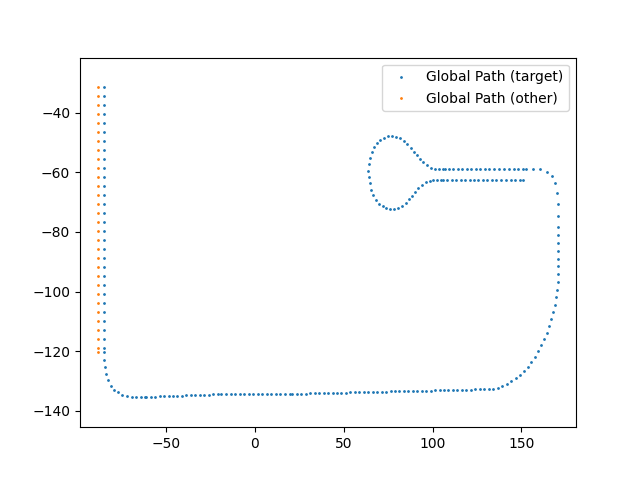
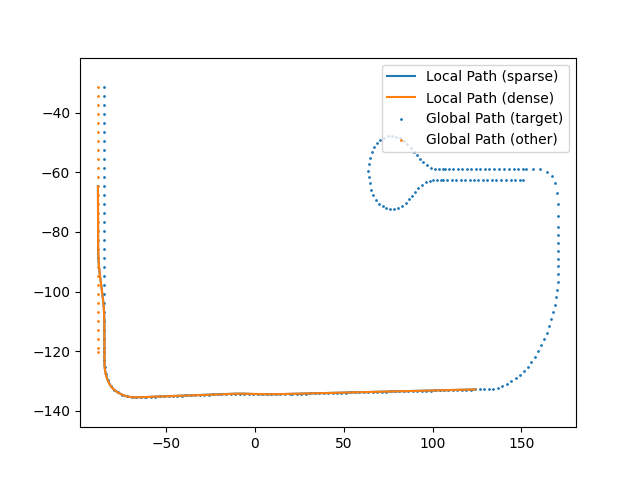

# Planning Package

Dieses Paket ist verantwortlich für die Routenplanung und Pfadplanung für das Ego-Vehicle sowie die erkannten
Verkehrsteilnehmer. Dafür wurden die folgenden ROS-Nodes implementiert:

- `paf_global_planner` für die Planung einer Route von einem Startpunkt zu einem oder einer Liste an Zielpunkten
- `paf_local_planner` für die Lokale Pfadplanung inklusive Spurwahl
- `paf_obstacle_planner` für die Vorhersage von Pfaden anderer Fahrzeuge und generieren von Folgefahrzeug-Informationen

## Hilfsklassen

Die unter `classes` in diesem Paket befindlichen Hilfsklassen werden sowohl verwendet, um den Zugriff mehrerer Nodes auf
die gleiche Funktionalität zu ermöglichen, als auch um das Debugging außerhalb der ROS-Umgebung zu ermöglichen. Aus
diesem Grund beinhaltet keine dieser Klassen Subscriber, Publisher oder Services, sondern ist allein zur Verarbeitung
der erhaltenen Messages verantwortlich.

### Helper Functions

Die unter `HelperFunctions.py` gelisteten Funktionen sind für geometrische Berechnungen (Entfernungen, Splines, Winkel,
etc.) innerhalb der Nodes und anderen Klassen zu verwenden.

### Map Manager

Der MapManager wird von allen Nodes dieses Packages als Planungsbasis verwendet und ist für die Verwaltung aller
statischen Kartendaten verantwortlich. Mit `MapManager.get_current_scenario()` können beispielsweise die aktuellen
Kartendaten aus der Dateistruktur in die jeweilige Node geladen werden. Zudem stehen ein debugging-Tool über Matplotlib
zur Verfügung, um eine CommonroadRoute außerhalb mit matplotlib darzustellen. Für die Visualisierung von verarbeiteten
Pfaden für diese Anwendung sollte allerdings eher `LocalPath.visualize()` verwendet werden.

### Speed Calculator

Die Aufgabe des `SpeedCalculator` ist die Verarbeitung von Geschwindigkeitsinformationen, insbesondere die Berechnung
von Kurvengeschwindigkeit und Entschleunigungskurven für den Bremsweg des Fahrzeugs.

Parameter:

- `MERGE_SPEED_RESET = 50 / 3.6` Geschwindigkeit wird beim Merge zweier Lanelets auf diese Geschwindigkeit
  zurückgesetzt (mit Regeln).
- `APPLY_MERGING_RESET = True` Reset der Geschwindigkeit bei Merges
- `SPEED_LIMIT_MULTIPLIER = 1` Multiplikation der Werte der Geschwindigkeitsschilder mit diesem Wert
- `CURVE_RAD_MEASURE_STEP = 5` Kurvenradius nur alle x Meter berechnen (Rauschen vermindern)
- `FULL_VS_HALF_DECEL_FRACTION = 0.97` letzte 3% eines Abbremsvorgangs werden aus Präzisionsgründen mit halber
  Bremswirkung angenommen.
- `MUST_STOP_EVENTS` bei diesen Signalen ist ein Stopp immer erforderlich (0 km/h)
- `CAN_STOP_EVENT` bei diesen Signalen ist ein Stopp nicht erforderlich (momentan nicht in Verwendung)
- `UNKNOWN_SPEED_LIMIT_SPEED` falls die Geschwindigkeit unbekannt ist, diesen Wert annehmen
- `CITY_SPEED_LIMIT` überschreibt `UNKNOWN_SPEED_LIMIT_SPEED` im Modus mit Regeln
- `MAX_SPEED` global maximal erlaubte Geschwindigkeit
- `MIN_SPEED` minimale Geschwindigkeit in einer Kurve
- `CURVE_FACTOR` Multiplikator für erhaltene Kurvengeschwindigkeiten (s.u.)
- `MAX_DECELERATION` Grenzwert für das Einfügen von linearer Bremskraft in die Geschwindigkeitsvorgabe

#### Kurvengeschwindigkeit

Die Berechnung der Kurvengeschwindigkeit geschieht in drei Schritten

1. Zunächst wird der Abstand des Mittelpunkts vom Vektor zwischen dem vorherigen und dem nächsten Wegpunkt
   bestimmt. ([Referenz](https://en.wikipedia.org/wiki/Distance_from_a_point_to_a_line#Line_defined_by_two_points))
2. Mithilfe dieser drei Punkte und dem berechneten Abstand wird der Radius der Kurve
   bestimmt. ([Referenz](https://www.mathopenref.com/arcradius.html), siehe Bild)
3. Im letzten Schritt wird abhängig vom
   Kurvenradius [mit einer Formel](https://www.state.nj.us/transportation/eng/tools/CalculatorESafeSpeedLessThanEqualTo50.shtm)
   die Zielgeschwindigkeit errechnet. Die seitliche Straßenneigung wird dabei hier vernachlässigt.

#### Bremsweg

In einem letzten Schritt wird (nach dem Hinzufügen von Stopps, Geschwindigkeitslimits, etc. vom Local Planner) eine
Beschleunigungswert für jeden Punkt auf dem Pfad berechnet. Falls ein gewisser Grenzwert überschritten wird, wird
Rückwirkend eine lineare Entschleunigung ab diesem Punkt eingeführt. Für die Beschleunigung wird ein beliebiger Wert
akzeptiert. Im folgenden Beispiel ist die Zielgeschwindigkeit (blau) und die Resultierende Geschwindigkeit mit
limitierter Bremskraft (orange) im Vergleich zu sehen:

## Global Planner

Die ROS-Node `paf_global_planner` ist für die Planung des Globalen Pfades (oder: Route) verantwortlich.

Parameter in GlobalPath.py

- `POINT_DISTANCE = 2.5` Distanz der Routensegmente im GlobalPath
- `TARGET_Z = 0` Zielhöhe, falls das Ziel sich unter einer Brücke befindet.

Parameter in paf_global_planner.py

- `BACKEND` zu verwendender Routenalgorithmus mit Commonroad. Erlaubt sind: `NETWORKX_REVERSED`,`NETWORKX`
  und `PRIORITY_QUEUE`

Subscriber

- `/paf/paf_local_planner/routing_request` (`PafRoutingRequest`) asynchrone Anfrage für eine neue Route
- `carla/ego_vehicle/odometry` (`Odometry`)
- `/paf/paf_local_planner/rules_enabled` (`Bool`) Wechsel des Modus während der Laufzeit

Publisher

- `/paf/paf_validation/draw_map_points` (`PafTopDownViewPointSet`) debugging Punkte an TopDownView senden
- `/paf/paf_validation/score/start` (`Empty`) Scoreboard neu starten
- `/paf/paf_global_planner/routing_response` (`PafLaneletRoute`) asynchrone Antwort mit einer neuen
- `/paf/paf_global_planner/routing_response_tdv` (`PafLaneletRoute`) senden der Route an TopDownView

Services

- `/paf/paf_local_planner/reroute` (`PafRoutingService`)
- `/paf/paf_local_planner/routing_request_standard_loop` (`PafRoutingService`)
- `/paf/paf_local_planner/routing_request_random` (`PafRoutingService`)

### Schritt 1: Commonroad Route Planner

Im ersten Schritt wird der [Commonroad Route Planner](https://gitlab.lrz.de/tum-cps/commonroad-route-planner/) der
TUM-München verwendet, welcher über das Skript `_setup_commonroad.sh` im setup installiert wird. Commonroad arbeitet auf
dem OpenStreetMap-Format, welches nach dem Import der Kartendatei als `Scenario`-Objekt zur Verfügung steht.

Mit Angabe einer Startposition und Orientierung und eines Zielbereichs in Form eines Rechtecks oder Kreises kann ein
sogenanntes `PlanningProblem` erzeugt werden, welches dann mit dem `RoutePlanner` gelöst werden kann. Darauf erhält man
eine Liste an Routen-Lanelets sowie eine Liste an Punkten mit Abstand etwa 10cm. Falls mehrere Lösungen für das
Planungsproblem existieren, werden diese ebenfalls zurückgegeben. Die gewählte Route ist in dieser Arbeit allerdings
immer die kürzeste. Eine Commonroad Route lässt sich wie folgt visualisieren:

Die Liste an Lanelets ist die Basis für die weitere Berechnung. Die Punkte der Commonroad-Route werden verworfen. Die
Berechnung der CR-Route wird in `paf_global_planner.py` durchgeführt.

### Schritt 2: Global Path

In diesem Schritt wird das Ergebnis von Schritt 1 (eine Liste an Lanelets) weiterverarbeitet. Um dem Local Planner
möglichst viel Handlungsspielraum zu lassen, werden zunächst alle validen Spuroptionen (blau und orange) und die
Zielspuren (blau) berechnet, auf die bei Spurverengungen gewechselt werden muss. Die Route wird dabei in eine Liste
an `PafRouteSection` eingeteilt, die jeweils alle Informationen für einen Routenschnitt aller Spuren enthalten. (Unter
anderem genau zwei Punkte bei einer zweispurigen Straße pro Sektion). Dabei ist garantiert, dass sich die parallelen
Punkte immer auf gleicher Höhe zueinander befinden.

## Local Planner

In diesem Package wird die `PafLaneletRoute` mit einer Liste an `PafRouteSection` verwaltet. Dazu gehören u.a. die
Spurwahl, das Ampelmanagement und der Spurwechsel. In der Node in `paf_local_planner.py` werden alle ROS-Informationen
gesammelt und mithilfe des `LocalPath` in eine Handlungsanweisung für das Acting umgewandelt. Im Folgenden ein
Beispielpfad als Teil der Route inklusive Spurwechsel.

Dabei wird durch alle Sektionen des GlobalPath iteriert und erlaubte Geschwindigkeit, sowie die bevorzugte Spur
basierend auf der Hinderniserkennung (`obstacle planner`) ergänzt. Auf dieser Liste (`sparse local path`) an
Pfadpunkten (je einer pro Segment) wird dann mithilfe von Bezier-, Tangenten- und Splineberechnungen eine
Handlungsanweisung mit hoher Punktzahl und Zielgeschwindigkeit pro Pfadpunkt berechnet und an das Acting
geschickt (`dense local path`).

### paf_local_planner.py

Parameter:

- `UPDATE_HZ` Frequenz, in der die State-Machine abgefragt werden soll
- `REPLAN_THROTTLE_SEC_GLOBAL` Maximale GlobalPath-Replanning Frequenz durch diesen Wert festgelegt
- `REPLAN_THROTTLE_SEC_LOCAL` Maximale LocalPath-Replanning Frequenz durch diesen Wert festgelegt
- `END_OF_ROUTE_REACHED_DIST` Ab dieser Distanz zum Zielpunkt wird ein "end of route handling" aufgerufen.
- `USE_GLOBAL_STANDARD_LOOP` Im Validation Modus (-val im `runscript`) wird eine im `MapManager` festgelegte Route
  abgefahren. Alternativ wird beim Erreichen des Ziels ein zufälliger nächster Zielpunkt gewählt.
- `AMERICAN_TRAFFIC_LIGHT_LIMITS` Beschreibung, wie amerikanische Ampeln aus dem Sensorbild gefiltert werden (Ampeln
  sind in den USA auf der gegenüberliegenden Straßenseite)
- `EUROPEAN_TRAFFIC_LIGHT_LIMITS` Beschreibung, wie europäische Ampeln aus dem Sensorbild gefiltert werden (Ampeln in
  der EU sind direkt neben der Stopplinie)

Subscriber:

- `carla/ego_vehicle/odometry` (`Odometry`)
- `/paf/paf_local_planner/rules_enabled` (`Bool`)
- `/paf/paf_global_planner/routing_response` (`PafLaneletRoute`) Asynchrone antwort auf eine Routenanfrage
- `/paf/paf_perception/detected_traffic_lights` (`PafDetectedTrafficLights`) Ergebnis der Traffic Light Detection

Publisher:

- `/local_planner/ego_vehicle/emergency_break` (`Bool`) Aktiviere Vollbremsung (Handbremse und Rückwärtsfahren)
- `/paf/paf_validation/score/start` (`Empty`)
- `/paf/paf_validation/speed_text` (`PafSpeedMsg`) Debugging-Nachricht an TopDownView (Momentan- und
  Zielgeschwindigkeit)
- `/paf/paf_local_planner/activate_traffic_light_detection` (`Bool`)
- `/paf/paf_validation/score/stop` (`Empty`) Scoreboard, beende aktuellen Lauf

Aufgerufene Services:

- `/paf/paf_local_planner/reroute` (`PafRoutingServiceResponse`)
- `/paf/paf_local_planner/routing_request_standard_loop` (`PafRoutingServiceResponse`)
- `/paf/paf_local_planner/routing_request_random` (`PafRoutingServiceResponse`)

### LocalPath.py

Parameter:

- `DENSE_POINT_DISTANCE` Abstand zweier Punkte auf dem Local Path in Metern (0,25m)
- `TRANSMIT_FRONT_MIN_M` Mindestlänge des Local Path in Metern ab der Fahrzeugposition
- `TRANSMIT_FRONT_SEC` Mindestlänge des Local Path in Sekunden bei konstanter Fahrt mit der aktuellen Geschwindigkeit
- `LANE_CHANGE_SECS` Sekunden benötigt für einen Spurwechsel (Streckenumrechnung mit erlaubter Geschwindigkeit)
- `STRAIGHT_TO_TARGET_DIST` Ab dieser Distanz wird ein direkter Vektor zum Zielpunkt gefahren (falls der Zielpunkt nicht
  genau auf der Mitte einer Spur liegt)
- `END_OF_ROUTE_SPEED` Zielgeschwindigkeit beim Zielpunkt für sanftes Abbremsen am Ende
- `SPLINE_IN_CURVE_RADIUS` Ab diesem Kurvenradius wird Spline-Berechnung statt Bezier-Berechnung verwendet (v.a. für die
  Kurven in Town02 notwendig)
- `OFFSET_LIGHTS_EU_M` Diese Distanz vor einer EU-Ampel anhalten (um diese im Kamerabild zu behalten)
- `CLEARING_SIGN_DIST_LIGHT` Diese Distanz zu einer Ampel (wenn grün) markiert die Ampel als "irrelevant"
- `CLEARING_SIGN_DIST` Diese Distanz zu anderen Signalen markiert dieses als "irrelevant"
- `RESUME_COURSE_COLORS` Diese Ampelfarben zur Weiterfahrt akzeptieren
- `PREFER_TARGET_LANES_DIST` Ab dieser Distanz zu einer Fahrbahnverengung/Ausfahrt/Abbiegung die Zielspur der
  Geradeausspur bevorzugen.

Aufgerufene Services:

- `/paf/paf_obstacle_planner/lane_info_service` (`PafLaneInfoServiceResponse`) Anfrage an den `obstacle planner` für die
  Spurwahl.

## Obstacle Planner

Der Obstacle Planner ist dafür verantwortlich, die Hindernisse des `semantic_lidar`-Node zu verwalten und eine
Handlungsempfehlung als `PafObstacleFollowInfo` für das Acting zu veröffentlichen, welche eine Distanz zum nächsten
relevanten Hindernis und eine vermutete Geschwindigkeit enthält. Hierbei werden nur dynamische Hindernisse betrachtet,
also nur Fußgänger und Fahrzeuge.

Parameter:

- `ON_LANELET_DISTANCE` Distanz, bei der Fahrzeuge als "auf der Fahrbahn" identifiziert werden
- `ON_LANELET_DISTANCE_PEDESTRIANS` Distanz, bei der Fußgänger als "auf der Fahrbahn" identifiziert werden
- `SHOW_TRACE_PTS` Punkte der Pfadvorhersage auf dem TopDownView anzeigen
- `SHOW_FOLLOW_PTS` Punkte in TopDownView veröffentlichen, auf die das Acting mit der `PafObstacleFollowInfo` reagieren
  soll.
- `SAFETY_DISTANCE` Diesen Abstand vom detektierten Abstand als Sicherheitswert abziehen, um Kollision zu vermeiden.

Subscriber:

- `carla/ego_vehicle/odometry` (`Odometry`)
- `/paf/paf_perception/obstacles` (`PafObstacleList`) Liste an erkannten Hindernissen
- `/paf/paf_local_planner/path` (`PafLocalPath`) Aktueller Pfad

Publisher:

- `/paf/paf_obstacle_planner/following_info` (`PafObstacleFollowInfo`) Information ans Acting, um auf dynamische
  Hindernisse zu reagieren

Services:

- `/paf/paf_obstacle_planner/lane_info_service` (`PafLaneInfoService`) Berechnung der `PafObstacleFollowInfo` begrenzt
  auf einen bestimmten Pfad (Spurwechselabfrage)

Für alle erkannten Fahrzeuge zudem eine Vorhersage getroffen, auf welchen Pfaden sich das Objekt auf dem Lanelet-Network
bewegen wird. An Kreuzungen kann diese Vorhersage auch Verzweigungen enthalten.

Alle Fahrzeuge und Fußgänger, die sich nicht auf dem Pfad oder direkt vor dem Fahrzeug befinden, werden ebenfalls
verworfen. Lediglich Fahrzeuge, dessen Pfadvorhersage auf den Pfad des Ego Vehicles treffen, werden weiterhin
zugelassen. Fußgänger werden zudem nur dann beachtet, wenn sie sich auf einer Fahrbahn befinden.

Im Anschluss werden alle so gesammelten Informationen nach Distanz zum Fahrzeug gefiltert und das mit dem geringsten
Abstand veröffentlicht. Falls keine relevanten Hindernisse erkannt wurden, kann dies ebenfalls in der Nachricht vermerkt
werden.
